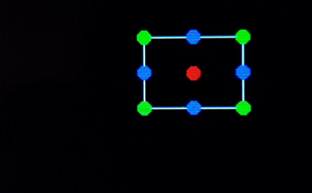
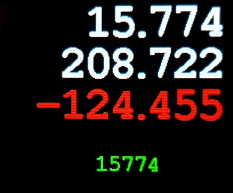

# DisplayUtils


## DisplayArea Class

A class that defines an area of the display and provides a host of utility methods for determining the absolute display x, y posion of various attributes such as b() (bottom), l() (left), cp() (centre point) etc.


[```examples/DisplayArea.ino```](examples/DisplayArea.ino)

Method names are deliberately kept short (concise, or terse, even) because, as shown in the examples,  they are frequently called withing the arguments of other class methods.


## DisplayNumber Class

A DisplayArea class for flicker free drawing of large (both number of digits and physical size) numbers that change frequently. Only refreshes digits that have changed.


[```examples/DisplayNumber.ino```](examples/DisplayNumber.ino)

Requires Adafruit's excellent GFX library and must use the 'alternate' fonts (located in the GFX Fonts folder), not the buit-in font - which looks terrible scaled up... 

See  https://learn.adafruit.com/adafruit-gfx-graphics-library/using-fonts

Digits are drawn as fixed width (except decimal point, which is half width) but a fixed width font is not essential as the width is based on the widest 0-9 digit.

You *must* call begin() in setup() to define the font after GFX begin() but before using h(), w() or draw(). 

Calling width & height will return zero and draw wll return false if called before the font is set.

The position, font, format background and foreground colours can be changed at runtime but you are responsible for clearing the old area first.

All methods from DisplayArea are available.

